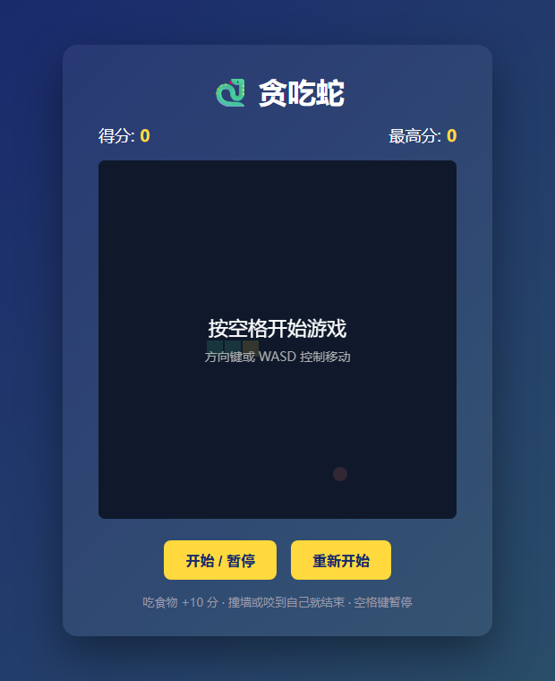

# 🐍 贪吃蛇小游戏

一个用纯原生网页技术实现的经典贪吃蛇游戏，无任何第三方依赖，打开即玩。



## ✨ 功能特性

- 🎮 **双操作方式**：支持方向键和 `WASD` 键控制
- ⏸️ **暂停 / 继续**：空格键随时暂停，再按继续
- 🍎 **计分系统**：每吃一个食物 +10 分
- 🚀 **动态加速**：每得 30 分自动提速，最高速 60ms/步
- 🏆 **最高分记录**：本次会话内记住最高分
- 💀 **完整判定**：撞墙、咬到自己都会结束游戏
- 🔄 **一键重开**：游戏结束后可立即重新开始

## 🕹️ 玩法说明

| 操作 | 按键 |
|---|---|
| 开始 / 暂停 | `空格` |
| 向上移动 | `↑` 或 `W` |
| 向下移动 | `↓` 或 `S` |
| 向左移动 | `←` 或 `A` |
| 向右移动 | `→` 或 `D` |

> 蛇不能 180° 原地掉头，所以不用担心误按反方向键直接结束。

## ️ 技术栈

- **HTML5** —— 页面结构 + `<canvas>` 画布
- **CSS3** —— 布局、渐变背景、卡片样式
- **原生 JavaScript** —— 全部游戏逻辑，零依赖

## 📁 项目结构

```
snake-game/
├── index.html          页面骨架与画布
├── style.css           外观样式
├── script.js           游戏核心逻辑
└── docs/
    └── screenshot.png  运行截图
```

## 🧠 核心实现思路

游戏的心跳在 `update()` 函数，每一帧（默认 150ms）执行一次：

1. **计算新蛇头** —— 当前蛇头坐标 + 移动方向
2. **碰撞检测** —— 是否越界（撞墙）或落在蛇身上（咬自己）
3. **移动蛇身** —— 新蛇头插入数组头部；若吃到食物则保留尾部（变长），否则移除尾部（等长前进）
4. **重新绘制** —— 清空画布，画出食物和整条蛇

渲染用 `setInterval` 驱动，蛇身是一个坐标数组，头在 `snake[0]`。

## 🚀 如何运行

无需安装任何东西：

1. 下载或克隆本仓库
2. 双击 `index.html` 用任意现代浏览器打开
3. 按空格开始游戏

或克隆到本地：

```bash
git clone https://github.com/guolifang58/snake-game.git
```

## 📄 License

MIT
